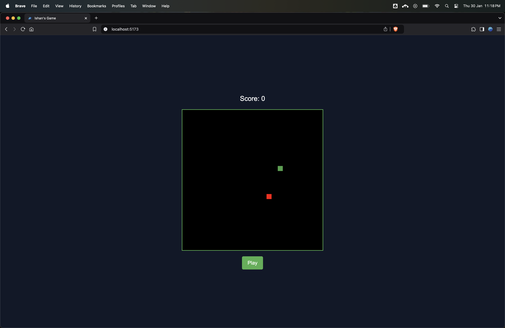
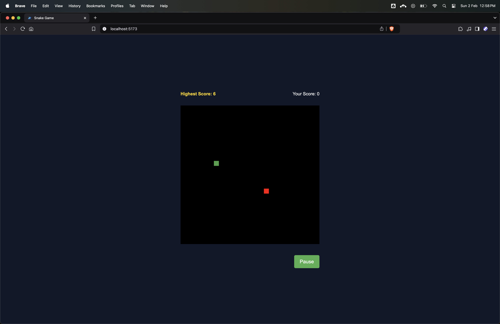

# React Snake Game 🐍  

[](https://react.dev/)  
[](https://vitejs.dev/)  

A modern implementation of the classic Snake game with React, Vite, and Tailwind CSS, featuring difficulty levels and pause functionality.  
🎮 [Play the Snake Game](https://snake-game-oexj.onrender.com/)


  
  

---

## 🚀 Features  

- 🎮 Classic Snake gameplay mechanics  
- ⚡ Built with **React + Vite**  
- 🎨 Styled using **Tailwind CSS**  
- ⚙️ Difficulty levels (**Easy / Medium / Hard**)  
- ⏯️ Pause / Resume functionality  
- 📊 Score tracking system  
- 💻 Fully **responsive design**  

---

## 🛠 Installation  

1. **Clone the repository**  
   ```bash
   git clone https://github.com/your-username/snake-game.git
   ```

2. **Navigate to the project directory**  
   ```bash
   cd snake-game
   ```

3. **Install dependencies**  
   ```bash
   npm install
   ```

4. **Start the development server**  
   ```bash
   npm run dev
   ```

---

## 🎮 Usage  

### **Start Game**  
- Click on **"Start Game"** from the main menu  

### **Controls**  
- 🔼🔽◀️▶️ **Arrow keys** → Move the snake  
- ⏸ **Spacebar** → Pause / Resume  

### **Difficulty Levels**  
- 🟢 **Easy** → Slow snake speed  
- 🟡 **Medium** → Moderate speed  
- 🔴 **Hard** → Fast-paced challenge  

---

## 🏗 Technologies Used  

- ⚛️ **React 18**  
- ⚡ **Vite 4**  
- 🎨 **Tailwind CSS 3**  
- 🎮 **HTML5 Canvas**  
- 🚀 **ES6+ JavaScript**  

---

## 🤝 Contributing  

Contributions are welcome! Follow these steps to contribute:  

1. **Fork the repository**  
2. **Create a feature branch**  
   ```bash
   git checkout -b feat/your-feature
   ```
3. **Commit your changes**  
   ```bash
   git commit -m "feat: add your feature"
   ```
4. **Push to your branch**  
   ```bash
   git push origin feat/your-feature
   ```
5. **Open a Pull Request**  

---

## 📜 License  

This project is licensed under the **MIT License**.  

---

## 🙌 Acknowledgments  

- Inspired by the **classic Nokia Snake game**  
- Built with **modern web technologies**  

---

### **To set up Git properly after deleting the `.git` folder:**  

1. **Initialize a fresh repository**  
   ```bash
   rm -rf .git  # If previous .git exists
   git init
   ```
